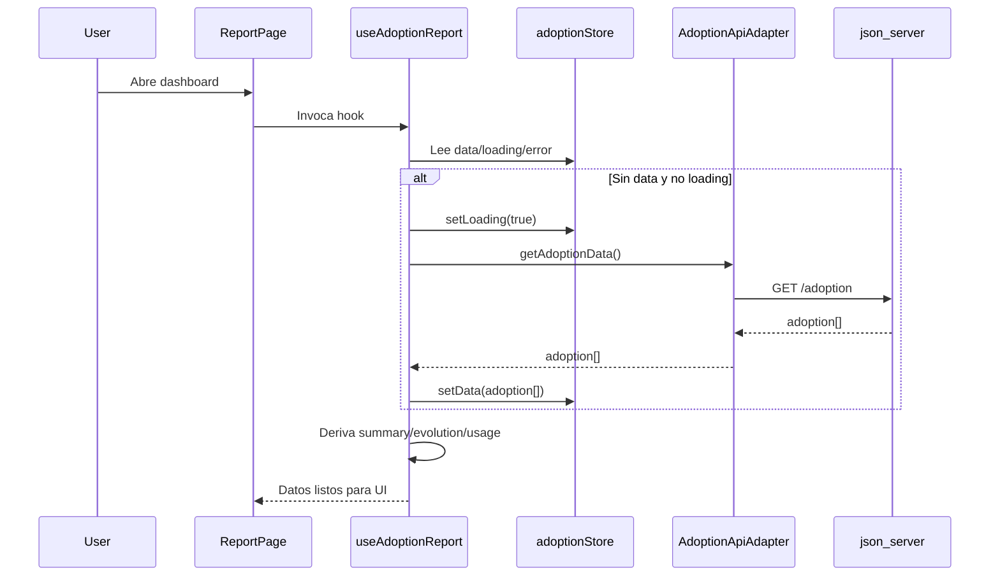

# Data Flow

## Flujo principal de datos

La UI consume un unico punto de entrada: `useAdoptionReport`.

## Transformaciones de negocio

- `computeSummary`: resumen ejecutivo del ultimo mes.
- `getEvolutionCodingTools`: evolucion de herramientas coding.
- `getEvolutionGeneralTools`: evolucion de herramientas general.
- `getUsageByTool`: uso por herramienta en ultimo mes.

## Estados de error

- El adapter encapsula errores HTTP y transforma a `Error`.
- El hook captura errores y los expone para la vista.
- La pagina muestra bloque de error y accion de reintento.
