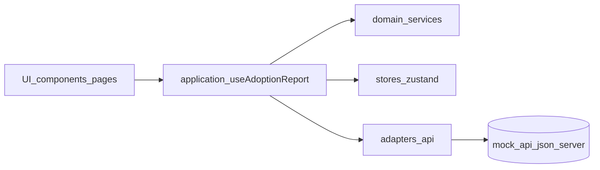

# Architecture Overview

## Objetivo

Describir la arquitectura general del frontend del Reporte de Adopcion y las responsabilidades por capa.

## Estilo arquitectonico

Se usa una variante ligera de Ports and Adapters (hexagonal) para separar:

- Logica de negocio pura (`domain`).
- Contratos (`ports`).
- Implementaciones de infraestructura (`adapters`).
- Orquestacion y estado (`application` + `stores`).
- Presentacion (`components` + `pages`).

## Diagrama de capas

## Principios aplicados

- Dependencias dirigidas hacia capas estables.
- UI sin conocimiento de detalles HTTP.
- Reglas de negocio testeables sin React ni I/O.
- Cambios de fuente de datos encapsulados en adapters.

## Referencias internas

- [Project Structure](./project-structure.md)
- [Data Flow](./data-flow.md)
- [Testing Strategy](./testing-strategy.md)
- [Design Decisions (root)](../../DESIGN_DECISIONS.md)
