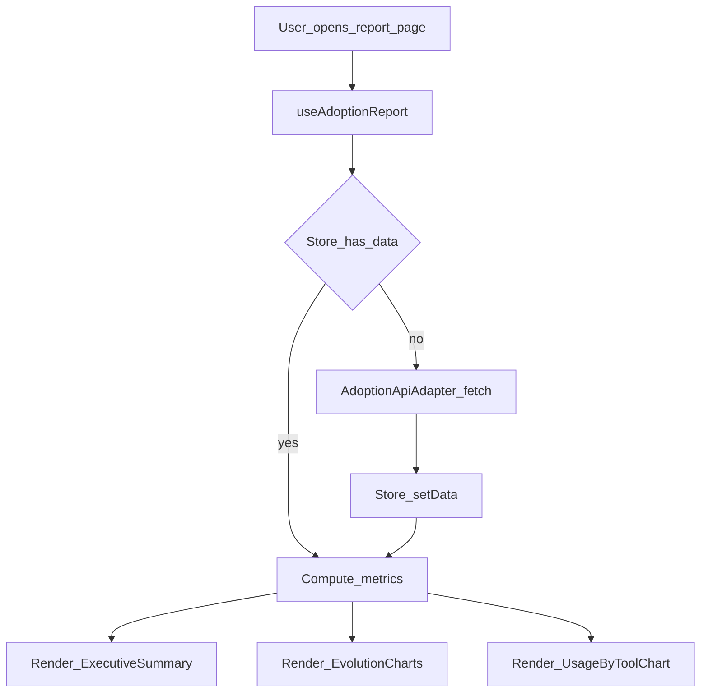

# Adoption Report Flow

## Flujo funcional

## Casos clave

- Carga inicial sin datos en store.
- Reuso de datos ya cargados.
- Estado de error con opcion de reintento.
- Render de estados `loading` y `empty`.
